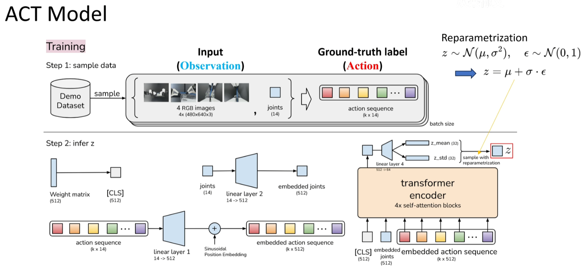
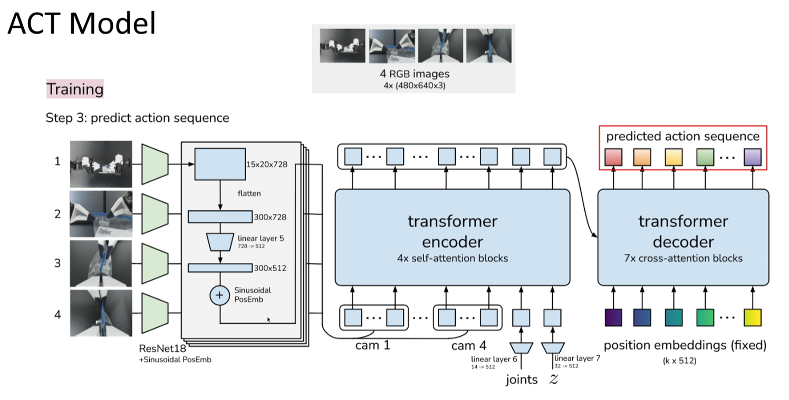

# ACT 项目阅读、运行和修改笔记

这份笔记用于快速接手当前项目：先看核心文件，再跑通数据采集、训练和评估，最后根据任务需要修改数据、环境、策略或网络结构。

## 一、先看哪些代码

建议按下面顺序阅读：

| 顺序 | 文件或目录 | 重点 |
| --- | --- | --- |
| 1 | `README.md` | 项目用途、安装方式、示例命令 |
| 2 | `constants.py` | 任务配置、数据目录、episode 长度、相机名、机械臂和夹爪常量 |
| 3 | `record_sim_episodes.py` | 在仿真里生成示教数据，并保存为 `episode_*.hdf5` |
| 4 | `scripted_policy` | 手写轨迹策略，决定方块转移、插孔任务的示教动作 |
| 5 | `sim_env.py` | 关节空间控制环境，训练和评估时主要使用 |
| 6 | `ee_sim_env.py` | 末端位姿控制环境，采集脚本先用它生成轨迹 |
| 7 | `utils/visualization.py` | 把 HDF5 数据转成视频和关节曲线，检查数据是否正常 |
| 8 | `utils/data.py` | 数据集读取、归一化、训练/验证划分 |
| 9 | `utils/pose.py`、`utils/helpers.py` | 随机物体 pose、随机种子、字典均值等工具 |
| 10 | `imitate_episodes.py` | 训练和评估主入口，绝大多数运行参数都从这里进入 |
| 11 | `model/act.py` | `ACTPolicy` 和 `CNNMLPPolicy` 的封装，训练损失也在这里 |
| 12 | `model/builder.py` | 把训练传入的配置整理成模型和优化器 |
| 13 | `model/act_vae.py` | ACT 主体结构，包含 CVAE、动作块预测头、CNNMLP baseline |
| 14 | `model/transformer.py` | Transformer encoder/decoder 实现 |
| 15 | `model/backbone.py`、`model/position_encoding.py` | 图像特征提取和位置编码 |

如果时间有限，先读 `constants.py -> record_sim_episodes.py -> imitate_episodes.py -> model/act.py -> model/act_vae.py`，基本就能理解主流程。

## 二、整体流程

```mermaid
flowchart LR
    A["scripted_policy<br/>手写示教轨迹"] --> B["record_sim_episodes.py<br/>采集仿真数据"]
    B --> C["episode_*.hdf5<br/>图像 / qpos / qvel / action"]
    C --> D["utils/data.py<br/>读取、切分、归一化"]
    D --> E["imitate_episodes.py<br/>训练循环"]
    E --> F["model/act.py<br/>损失与策略封装"]
    F --> G["model/act_vae.py<br/>ACT 网络"]
    G --> H["policy_best.ckpt<br/>dataset_stats.pkl"]
    H --> I["imitate_episodes.py --eval<br/>仿真评估"]
    I --> J["video*.mp4<br/>result_*.txt"]
```



训练时，每次从一个 episode 中随机取一个时间步，输入当前相机图像和机器人关节状态，同时把之后一段动作序列作为监督信号。ACT 会一次预测未来多个动作，也就是 `chunk_size` 个动作。

评估时，没有真实动作序列输入，网络根据当前图像和关节状态预测动作块。默认每隔 `chunk_size` 步重新查询一次策略；如果加 `--temporal_agg`，每一步都会重新预测，并对多个时间点预测到的当前动作做加权平均，动作通常更平滑。

## 三、原理图

训练阶段主要用真实动作序列推断隐变量 `z`，再让解码端预测动作块：



预测阶段主要是把相机图像经过 ResNet 提取特征，再和关节状态、隐变量一起送进 Transformer，输出未来一段动作：



核心可以概括成三步：

1. 观测输入：相机图像 `image` 和机器人关节状态 `qpos`。
2. 动作块预测：Transformer decoder 输出长度为 `chunk_size` 的动作序列。
3. 执行动作：仿真环境每一步接收 14 维关节目标，包含左右臂各 6 个关节和各 1 个夹爪量。

训练损失在 `model/act.py` 的 `ACTPolicy.__call__` 里：

```text
loss = L1(action, predicted_action) + kl_weight * KL(z)
```

其中 L1 负责让预测动作接近示教动作，KL 负责约束隐变量分布。

## 四、环境安装

推荐直接使用仓库里的环境文件：

```powershell
conda env create -f conda_env.yaml
conda activate aloha
```

如果环境已经建好，只需要：

```powershell
conda activate aloha
```

注意：项目依赖 MuJoCo、dm_control 和 PyTorch CUDA，训练和评估最好在有 NVIDIA 显卡的环境里运行。

## 五、运行步骤

### 1. 设置数据目录

先改 `constants.py` 里的 `DATA_DIR`，例如：

```python
DATA_DIR = 'D:/EmbodiedData/ACT'
```

后面的数据目录要和 `SIM_TASK_CONFIGS` 里的配置对应。比如 `sim_transfer_cube_scripted` 会默认读取：

```text
<DATA_DIR>/sim_transfer_cube_scripted
```

### 2. 采集仿真示教数据

方块转移任务：

```powershell
python record_sim_episodes.py --task_name sim_transfer_cube_scripted --dataset_dir D:/EmbodiedData/ACT/sim_transfer_cube_scripted --num_episodes 50
```

插孔任务：

```powershell
python record_sim_episodes.py --task_name sim_insertion_scripted --dataset_dir D:/EmbodiedData/ACT/sim_insertion_scripted --num_episodes 50
```

如果想看实时画面，可以加：

```powershell
--onscreen_render
```

第一次调试时可以先把 `--num_episodes` 改成 5，确认流程没问题后再采集完整数据。

### 3. 检查采集结果

```powershell
python -m utils.visualization --dataset_dir D:/EmbodiedData/ACT/sim_transfer_cube_scripted --episode_idx 0
```

运行后会在数据目录下生成：

```text
episode_0_video.mp4
episode_0_qpos.png
```

视频正常、关节曲线没有明显异常，再进入训练。

### 4. 训练 ACT

方块转移任务示例：

```powershell
python imitate_episodes.py --task_name sim_transfer_cube_scripted --ckpt_dir D:/EmbodiedData/ACT/checkpoints/transfer_cube_act --policy_class ACT --kl_weight 10 --chunk_size 100 --hidden_dim 512 --batch_size 8 --dim_feedforward 3200 --num_epochs 2000 --lr 1e-5 --seed 0
```

插孔任务只需要换任务名和保存目录：

```powershell
python imitate_episodes.py --task_name sim_insertion_scripted --ckpt_dir D:/EmbodiedData/ACT/checkpoints/insertion_act --policy_class ACT --kl_weight 10 --chunk_size 100 --hidden_dim 512 --batch_size 8 --dim_feedforward 3200 --num_epochs 2000 --lr 1e-5 --seed 0
```

训练输出主要包括：

```text
policy_best.ckpt
policy_last.ckpt
policy_epoch_*_seed_*.ckpt
dataset_stats.pkl
train_val_loss_seed_*.png
train_val_l1_seed_*.png
train_val_kl_seed_*.png
```

### 5. 评估模型

```powershell
python imitate_episodes.py --eval --task_name sim_transfer_cube_scripted --ckpt_dir D:/EmbodiedData/ACT/checkpoints/transfer_cube_act --policy_class ACT --kl_weight 10 --chunk_size 100 --hidden_dim 512 --batch_size 8 --dim_feedforward 3200 --num_epochs 2000 --lr 1e-5 --seed 0
```

如果想开启时间聚合：

```powershell
python imitate_episodes.py --eval --temporal_agg --task_name sim_transfer_cube_scripted --ckpt_dir D:/EmbodiedData/ACT/checkpoints/transfer_cube_act --policy_class ACT --kl_weight 10 --chunk_size 100 --hidden_dim 512 --batch_size 8 --dim_feedforward 3200 --num_epochs 2000 --lr 1e-5 --seed 0
```

评估默认跑 50 次 rollout，结果保存在 checkpoint 目录：

```text
video0.mp4
video1.mp4
...
result_policy_best.txt
```

## 六、常见修改位置

### 修改数据路径、episode 长度、相机

改 `constants.py`：

```python
DATA_DIR = 'D:/EmbodiedData/ACT'

SIM_TASK_CONFIGS = {
    'sim_transfer_cube_scripted': {
        'dataset_dir': DATA_DIR + '/sim_transfer_cube_scripted',
        'num_episodes': 50,
        'episode_len': 400,
        'camera_names': ['top']
    }
}
```

如果想加相机，例如 `angle`，需要保证环境观测里有这个相机名。`sim_env.py` 现在提供 `top`、`angle`、`vis` 三个视角。

### 修改示教轨迹

改 `scripted_policy` 模块：

| 类 | 对应任务 | 可改内容 |
| --- | --- | --- |
| `PickAndTransferPolicy` | 方块转移 | 抓取高度、交接位置、夹爪开合时间 |
| `InsertionPolicy` | 插孔 | peg/socket 抓取点、对齐位置、插入路径 |

每个 waypoint 里主要有四个字段：

```python
{"t": 120, "xyz": ..., "quat": ..., "gripper": 1}
```

`t` 是时间步，`xyz` 是末端位置，`quat` 是末端姿态，`gripper` 是夹爪开合。

### 修改训练超参数

一般先从命令行参数改：

| 参数 | 作用 |
| --- | --- |
| `--chunk_size` | 一次预测多少个未来动作 |
| `--kl_weight` | KL 损失权重 |
| `--hidden_dim` | Transformer 特征维度 |
| `--dim_feedforward` | Transformer FFN 中间层大小 |
| `--batch_size` | batch 大小 |
| `--num_epochs` | 训练轮数 |
| `--lr` | 主学习率 |

想改默认网络层数，可以看 `imitate_episodes.py` 里这些值：

```python
enc_layers = 4
dec_layers = 7
nheads = 8
backbone = 'resnet18'
```

### 修改损失函数

改 `model/act.py` 的 `ACTPolicy.__call__`。当前训练阶段做三件事：

1. 截取动作序列长度到 `num_queries`。
2. 用 L1 计算预测动作和真实动作的差。
3. 加上 KL 损失得到总损失。

如果要增加平滑损失、速度损失，或者只监督部分关节，也从这里改比较直接。

### 修改模型结构

主要看 `model/act_vae.py`：

| 位置 | 作用 |
| --- | --- |
| `DETRVAE.__init__` | 定义动作头、padding 头、query embedding、latent 维度 |
| `DETRVAE.forward` | 训练和评估的前向逻辑 |
| `latent_dim = 32` | 隐变量维度 |
| `action_head = nn.Linear(hidden_dim, state_dim)` | 输出 14 维动作 |
| `build()` | 构建 ACT 模型 |
| `CNNMLP` | 简单 baseline |

Transformer 细节在 `model/transformer.py`，图像 backbone 在 `model/backbone.py`。

### 新增一个仿真任务

通常需要改这几个地方：

1. 在 `assets/` 里准备新的 MuJoCo XML 和相关模型资源。
2. 在 `sim_env.py` 里给 `make_sim_env()` 加新任务分支。
3. 在 `sim_env.py` 里写一个新的 `Task` 类，重点是 `initialize_episode()`、`get_env_state()`、`get_reward()`。
4. 在 `ee_sim_env.py` 里补对应的末端控制环境。
5. 在 `constants.py` 的 `SIM_TASK_CONFIGS` 里加任务配置。
6. 在 `record_sim_episodes.py` 里选择对应的 scripted policy。
7. 如果需要示教轨迹，在 `scripted_policy` 模块里写新的策略类。

## 七、容易踩坑的点

1. `constants.py` 里的 `DATA_DIR` 默认是占位字符串，训练前一定要改。
2. 采集数据时传入的 `--dataset_dir` 要和 `constants.py` 中任务配置的 `dataset_dir` 对上，否则训练会找不到数据。
3. HDF5 文件名必须是 `episode_0.hdf5`、`episode_1.hdf5` 这种格式。
4. `camera_names` 改了之后，采集、训练和模型输入都会一起受影响，旧数据不一定还能直接用。
5. 代码里大量使用 `.cuda()`，没有可用 GPU 时会直接报错。
6. `sim_env.py` 用的是关节空间动作，`ee_sim_env.py` 用的是末端位姿动作，不要混着改。
7. `record_sim_episodes.py` 先用末端控制生成轨迹，再回放成关节控制数据，所以失败时要分别检查“生成轨迹”和“回放轨迹”两个阶段。
8. `policy_best.ckpt` 只保存模型参数，评估还需要同目录下的 `dataset_stats.pkl` 做归一化和反归一化。

## 八、调试建议

第一次跑建议按这个顺序：

1. 先采集 1 到 5 条数据，打开 `--onscreen_render` 看轨迹是否正常。
2. 用 `python -m utils.visualization` 看视频和关节曲线。
3. 用较小的 `--num_epochs` 试训，比如 50 或 100，确认 checkpoint 能保存。
4. 再用完整 episode 数和正式 epoch 数训练。
5. 评估时先不加 `--temporal_agg`，确认成功率后再比较加聚合的效果。

如果出现动作抖动或中途停顿，优先检查三件事：训练轮数是否足够、数据成功率是否太低、`chunk_size` 和 `temporal_agg` 是否适合当前任务。
